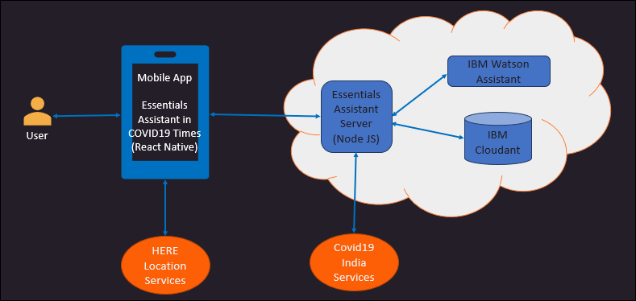
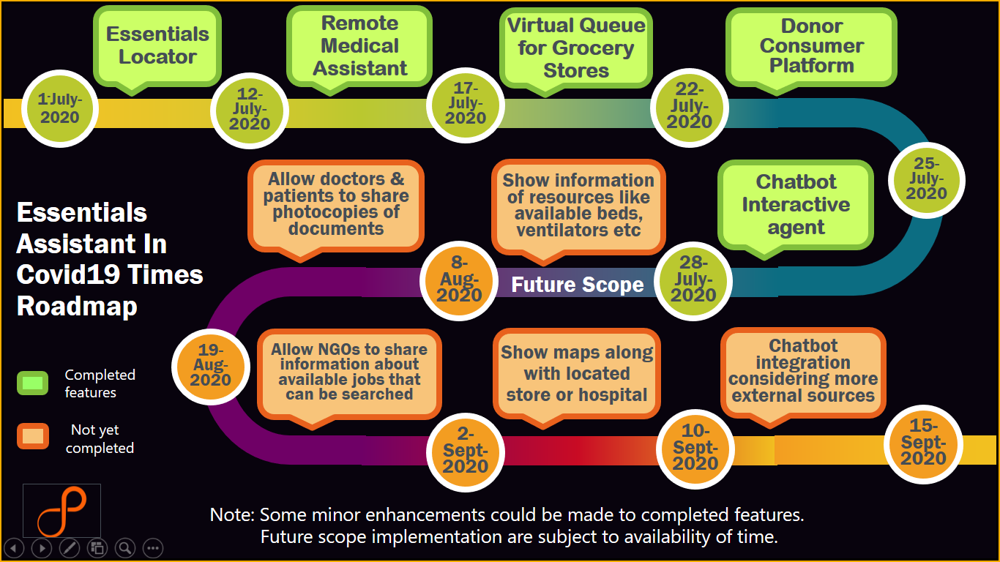

# Essentials Assistant in COVID19 Times
Essentials Assistant in COVID19 Times is a solution for COVID19 which was developed as a part of the ‘2020 Call For Code Global Challenge’ 
(https://callforcode.org/) 

## Contents
1.	[Short description](#short-description)
2.	[Demo video](#demo-video )
3.	[The architecture](#the-architecture)
4.	[Long description](#long-description)
5.	[Project roadmap](#project-roadmap)
6.	[Getting started](#getting-started)
7.  [Built with](#built-with)
8.	[Authors](#authors)
9.  [Referrences](#referrences)
10.	[License](#license)

## Short description

### What's the problem?
It is very difficult to provide medical assistance to people due to limited resources in COVID19 times. 
Also, managing the rush at grocery stores is also very difficult and this further increase risk of COVID19 spread. 
Also, people find it difficult to locate nearby Covid19 Testing Lab, Hospitals, Grocery stores, Free food, Shelter Homes etc. and 
sometimes it is hard to get right information about Covid19 related facts.

### How can technology help?
Mobile, web, and cloud services enable rapid deployment of applications that can empower cooperation in the community.
Maintaining a virtual queue for the grocery store users can help the users as well as the grocery store owners to adhere to the social distancing 
guidelines and stay safe. Providing a real-time audio/video platform enables users and doctors to communicate virtually thus keeping the users 
in track with their regular checkup routines and the doctors can remain safe. Creating a chatbot using Watson Assistant can help you address the 
issues that your users may face while trying to gather the necessary information. Embedding location/routing services (like HERE) can enhance such 
applications, giving optimum guidance so that they are outside of their isolation location for the minimum amount of time.

### The idea
It's imperative that the community does not face hassles while carrying out their regular activities in times of crises, such as the COVID-19 pandemic. 
The goal is to provide a mobile application, along with server-side components, that will address the local needs for food, equipment, and resources.

## Demo video

## The architecture

The ‘Essentials Assistant in COVID19 times’ mobile app which is developed in React-Native will be used by the mobile users having Android or iOS phones. 
If the user wants to find the nearby test center or grocery store, the request will go to the Essentials Assistant Server which is written in Node.js. 
This server will fetch the data from the COVID19 India Services. Also, the mobile app has features for HERE location services to find the information 
for nearby routes/grocery stores. The Essentials Assistant server will keep all the records in the IBM Cloudant database. 
Also, this server will internally use the IBM Watson Assistant for answering any queries which are entered by user via chatbot.

## Long description
1. About the solution

The 'Essentials Assistant in COVID19 times' solution provides various features like remote medical assistance from Doctors. 
If we reduce the direct contact of doctors with patients wherever possible, then it will reduce risk of COVID19 spread to doctors to some extent. 
It also helps in maintaining virtual queue for shopping in Grocery stores with allotted time-slots to avoid rush. 
It also provides feature of locating the nearby essentials like Covid19 Testing Lab, Hospitals, Grocery stores, Free food, Shelter Homes etc. 
This solution also provides interactive Chatbot agent to get the right information about Covid19 and related facts. 
Also, it provides a platform for donating items like masks, food that can be used by needy persons.

**In summary, the Solution covers Remote Medical Assistant, Virtual Queue for Grocery stores, Essentials locator, 
Donor Consumer Platform and Chatbot Interactive agent.**

2.	Impact of the solution

Below are some of the areas wherein the solution will prove very useful:

- The solution will assist in providing remote medical assistant to people due to limited resources in COVID19 times. 
NGOs can have dedicated volunteers with good mobile phone. These NGO volunteers can visit places like tribal areas, remote areas and 
then can use the App so that the people can have video calls with doctors wherein doctors are sitting in city hospitals. 
Thus it will save time and efforts and provide some quick help to people.

- Also, there are some asymptomatic patients who are at home and not hospitalised. Such people can have some routine consulting from doctors 
using the solution. Also, if we reduce the direct contact of doctors with patients wherever possible, then it will reduce risk of COVID19 spread to 
doctors (to some extent).

- In some cases, wherein there are 4-5 buildings or societies, and then the residents may want to go to nearby 1 shop for grocery shopping. 
But, then this may create lot of rush and impact the physical/social distancing guidelines. So, in such case, the grocery store owners can simply 
use the app and the residents in nearby area can use virtual queuing feature to ensure no rush in grocery store.

- Sometimes, there are some labours who may be looking for shelter homes or free food, then such people can find this information using the solution 
or with the help of NGOs using the Solution. Sometimes, people are not aware about the nearest testing centre, they can use this solution to locate 
the information.

- Sometimes, there may be groups of people or organisations who want to donate number of masks, PPE kits, gloves etc. 
In such case, such organizations can donate these items and NGOs can use this information for distributing these donated items to appropriate places.

## Project roadmap

## Getting started
### Prerequisites

- Install [React Native CLI dependencies](https://reactnative.dev/docs/getting-started.html). See the [React Native documentation](https://reactnative.dev/docs/environment-setup) for the exact steps and requirements based on your Operating System and Target OS. For example:
    - **iOS on macOS**
        - [Node.js](https://nodejs.org/en/)
        - [Watchman](https://facebook.github.io/watchman/docs/install)
        - [Xcode](https://itunes.apple.com/us/app/xcode/id497799835?mt=12)
        - [CocoaPods](https://guides.cocoapods.org/using/getting-started.html)
    - **Android on Windows**
        - [Node.js](https://nodejs.org/en/)
        - [Python 2](https://www.python.org/downloads/)
        - [Java Development Kit](https://www.oracle.com/java/technologies/javase-jdk8-downloads.html)
        - [Android Studio](https://developer.android.com/studio/index.html) - add Android 9 (Pie) SDK & configure `ANDROID_HOME`
        - [Create an Android Virtual Device (AVD)](https://developer.android.com/studio/run/managing-avds.html) - with Pie image (API Level 28)
- Clone the [repository](https://gitext.persistent.co.in/ibm-datacap-tools-team/toolsteam/tree/Essentials_Assistant).

### Steps

1. [Run the server](#1-run-the-server).
2. [Run the mobile application](#2-run-the-mobile-application).

### 1. Run the server

To set up and launch the server application:

1. Go to the `essentials-assistant-covid19/server-app` directory of the cloned repo.
1. From a terminal:
    1. Go to the `essentials-assistant-covid19/server-app/SocketServer` directory of the cloned repo.
    1. Install the dependencies: `npm install`.
    1. Go to the `essentials-assistant-covid19/server-app/CovidServer` directory of the cloned repo.
    1. Install the dependencies: `npm install`.
    1. Launch the server application locally:
        - To run locally:
            1. Start the application: `npm start`.
            1. The server can be accessed at <http://localhost:3000>.

### 2. Run the mobile application

To run the mobile application (using the Xcode iOS Simulator or Android Studio Emulator):

1. Go to the `essentials-assistant-covid19/mobile-app` directory of the cloned repo.
1. From a terminal:
    1. Go to the `essentials-assistant-covid19/mobile-app` directory.
    1. Install the dependencies: `npm install`.
    1. **iOS only**: Go to the `ios` directory: `cd ios`.
    1. **iOS only**: Install pod dependencies: `pod install`.
    1. **iOS only**: Return to the `mobile-app` directory: `cd ../`.
    1. Launch the app in the simulator/emulator:
        - **iOS only**: `npm run ios`
            > **Note**: You should be running at least iOS 13.0. The first time you launch the simulator, you should ensure that you set a Location in the Features menu.
        - **Android only**: `npm run android`
            > **Note**: Your Android Studio needs to have the `Android 9 (Pie)` SDK and a `Pie API Level 28` virtual device

## Built with
- [IBM Watson Assistant](https://www.ibm.com/cloud/watson-assistant/)– Chatbot
- [IBM Cloudant](https://www.ibm.com/cloud/cloudant) – The NoSQL database used
- [IBM Cloud Foundry](https://www.ibm.com/in-en/cloud/cloud-foundry) – Application server deployment
- [React Native](https://reactnative.dev/) – Mobile application 
- [Node.js](https://nodejs.org/en/) – Application Server
- [WebRTC](https://webrtc.org/) – Audio/video calling

## Authors
- Abhijit Dabhekar – abhijit_dabhekar@persistent.com 
- Arihant Patawari – arihant_patawari@persistent.com 
- Pradnya Valsangkar – pradnya_valsangkar@persistent.com 
- Ashwini Dongre - ashwini_dongre@persistent.com
- Pallavi Sinha – pallavi_sinha@persistent.com 

## Referrences
- [HERE API from HERE Developer Portal](https://developer.here.com/ref/IBM_starterkit_Covid?create=Freemium-Basic) 
- [Covid19 India API](https://api.covid19india.org/resources/resources.json)

## License
This solution starter is made available under the [Apache 2 License](LICENSE).
 
